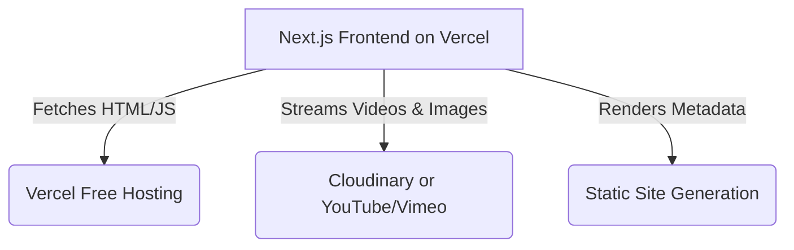

# Deployment Playbook - Hosting Media-Heavy Websites For Free

Your Kala Kasturi website is currently around **500MB to 600MB**, primarily due to the high-resolution artwork images and high-fidelity product MP4 video captures (e.g., the Vishwamitra video is **195MB** and Feminine Energy is **187MB**).

If you try to deploy this directly through GitHub and Vercel, you will hit major roadblocks:
1. **GitHub File Limit**: GitHub will **reject** your push if a single file is larger than **100MB** (your videos are 195MB and 187MB).
2. **Vercel Bandwidth Limit**: The Vercel Free Tier has a **100GB monthly bandwidth limit**. If users stream 195MB videos directly from your site, just **500 visits** will exhaust your monthly bandwidth and pause your site.

Here is the professional, 100% free architectural solution to bypass these limits and make your website load instantly.

---

## 🛠️ The Architecture: Decouple Your Media

Instead of storing heavy videos and images in your local `public/` folder, you should store them on a free external Media CDN that specializes in compression and fast delivery. 



---

## 🚀 Step 1: Optimize and Store Your Media (Free Options)

### Option A: Cloudinary (Highly Recommended)
Cloudinary has a generous **forever-free tier** (25GB of monthly bandwidth/storage credits). It is the industry standard for next-gen media delivery.
* **Why it fits**: Cloudinary automaticallycompresses and transcodes videos. It will shrink your **195MB video** down to **~10MB** on-the-fly without any noticeable loss in visual quality!
* **How to use**:
  1. Create a free account at [Cloudinary.com](https://cloudinary.com).
  2. Upload your images and videos to your media library.
  3. Copy the generated URLs (e.g., `https://res.cloudinary.com/.../vishwamitra_video.mp4`).
  4. Replace the local paths in `lib/data.ts` (e.g., swap `/products/Vishwamitra/...mp4` with the Cloudinary URL).

### Option B: YouTube or Vimeo (Easiest & Unlimited)
If you want **unlimited storage and 0MB bandwidth consumption**, you can host the videos on YouTube or Vimeo.
* **How to use**:
  1. Upload the videos to YouTube as **Unlisted** (so they aren't public on YouTube search feeds).
  2. Update the video player in `/app/products/[id]/page.tsx` to display an embedded iframe player instead of the native `<video>` tag.

---

## 📦 Step 2: Push Code to GitHub (Excluding Heavy Assets)

To make sure your GitHub push is fast and doesn't get rejected by the 100MB limit, we should tell Git to ignore the large video/image folders.

1. Open your `.gitignore` file (or create one in the root folder).
2. Add these lines to ignore the local raw product folder:
   ```text
   # Ignore heavy product assets
   public/products/
   ```
3. Push your codebase to a new repository on GitHub:
   ```bash
   git init
   git add .
   git commit -m "Initialize Kala Kasturi website"
   git branch -M main
   git remote add origin <your-github-repo-url>
   git push -u origin main
   ```

---

## ⚡ Step 3: Deploy to Vercel (100% Free)

Vercel is the creator of Next.js and provides the fastest, most reliable free hosting.

1. Go to [Vercel.com](https://vercel.com) and sign up using your GitHub account.
2. Click **Add New** > **Project**.
3. Import your GitHub repository.
4. Leave all settings at their default values and click **Deploy**.
5. Within 1 minute, your website will be live with a free SSL certificate on a `your-site.vercel.app` domain!

---

## 💎 Bonus: Compress Images and Videos Offline (Before Uploading)

If you still want to host everything locally in your `public/` directory, you can compress your raw media offline so they fit under the limits:
* **For Videos (Handbrake)**: Download the free app **[Handbrake](https://handbrake.fr/)**. Drop your videos in, choose the `Fast 1080p30` preset, and check the "Web Optimized" box. This will compress your 195MB videos to **~15MB**.
* **For Images (TinyPNG)**: Upload your product images to **[TinyPNG.com](https://tinypng.com/)**. It will compress your PNGs and JPGs by up to **80%** without reducing dimensions.
