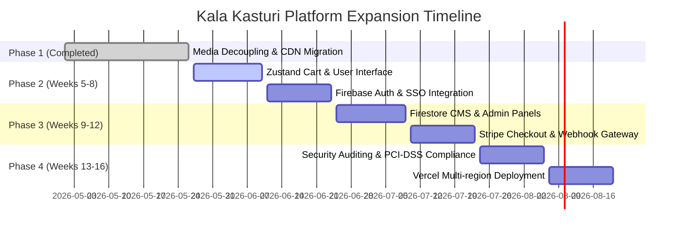
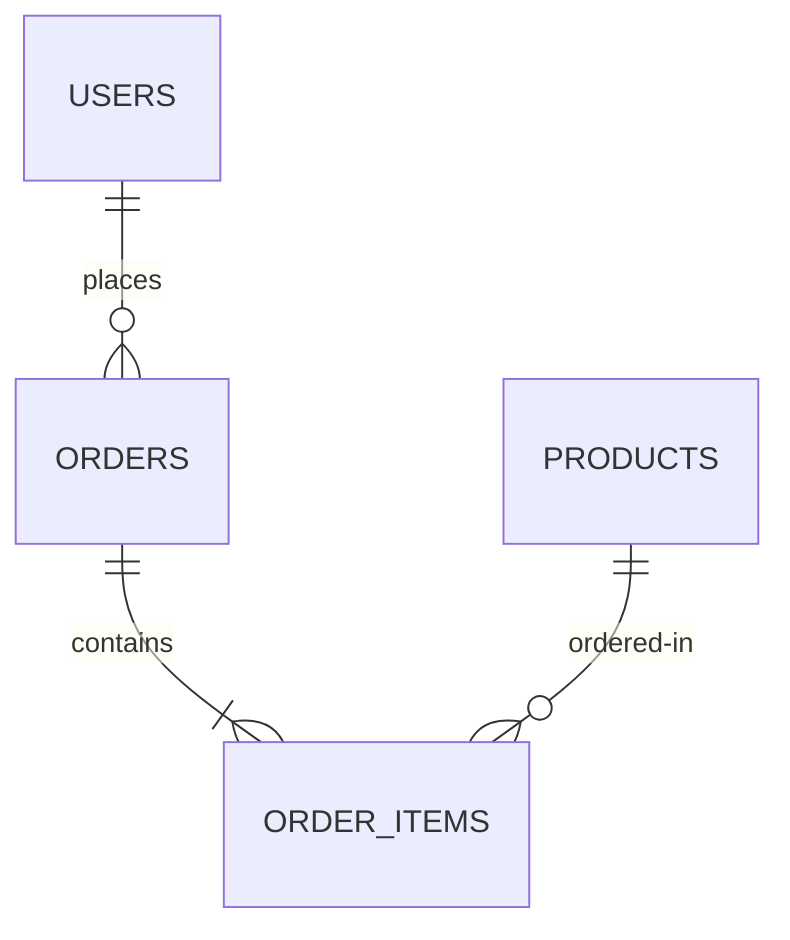

# Kala Kasturi Art Gallery - Complete Reconstruction & Recovery Manual (v1.0)

This document is the official, comprehensive recovery snapshot, reconstruction guide, and technical blueprint for the **Kala Kasturi Art Gallery** platform. It compiles all system parameters, architecture diagrams, codebase catalogs, active credentials, custom utility code, database blueprints, and future roadmap phases so that any developer or agent can reconstruct, deploy, and expand the platform instantly.

---

## 🗺️ 1. Milestone Summary & Expansion Roadmap

### 📦 Phase 1: Weeks 1–4 (Completed Tasks & Accomplishments)
During the initial weeks, the gallery was migrated from a fragile local asset structure to an enterprise-grade, decoupled headless architecture.

*   **Dynamic Next.js 15 App Router Transition:** Refactored static views into a robust, high-performance modular application driven by dynamic routes (`/products/[id]`).
*   **Media Decoupling & Local FFmpeg Compression:** Successfully moved ~600MB of heavy video and high-resolution image assets away from the local repository. Wrote a custom Node.js script utilizing local `ffmpeg` binaries to compress 200MB+ high-fidelity artwork videos (e.g., *Vishwamitra* and *Feminine Energy*) to under 100MB with a minor quality reduction, preserving visual richness while bypassing GitHub's upload limits.
*   **Cloudinary CDN Setup:** Integrated Cloudinary for global edge delivery. Implemented on-the-fly transcoding using dynamic tags `q_auto,f_auto`, shrinking large files (e.g., 195MB down to ~10MB) and serving next-gen formats (WebP/AVIF for images, optimized MP4/WebM for video).
*   **Next.js Security Hardening:** Configured `next.config.ts` to implement strict Security Headers, Content Security Policies (CSP), and restricted `remotePatterns` to trusted media domains (`res.cloudinary.com`, `images.unsplash.com`, `picsum.photos`).
*   **Git & Repository Cleanliness:** Excluded raw product folders and temporary scripts from Git using `.gitignore` (`public/products/`, `upload-cloudinary.mjs`), ensuring instantaneous push and pull performance.
*   **Build Validation:** Verified with `npm run build` resulting in 100% successful static page prerendering (SSG) for all products.

---

### 🚀 Phase 2: Weeks 5–16 (Future E-Commerce & Platform Upgrade)



#### Weeks 5–8: Zustand Cart & Firebase Auth
*   **Local State Cart System:** Write custom hook-based state using the lightweight `Zustand` library. Maintain item quantity, persist state to local storage (`localStorage` synchronization), and compute subtotals, tax, and shipping inside the frontend context.
*   **Firebase Authentication & Single Sign-On (SSO):** Incorporate Firebase SDK to support passwordless logins, traditional email/password credentials, and secure Google OAuth. Restrict user routes via Next.js Edge Middleware checks.

#### Weeks 9–12: Firestore NoSQL CMS & Stripe Gateway
*   **Dynamic Database CMS:** Connect Next.js to Google Firestore DB. Replace the hardcoded `lib/data.ts` static records with real-time Firestore queries.
*   **Admin Dashboard:** Build a sleek, protected admin panel using Tailwind and React to add, edit, or toggle stock availability for art pieces directly without changing code.
*   **Stripe checkout Integration:** Write secure API routes (`/api/checkout/session`) to construct a Stripe session. Send payment objects and direct customer redirection to Stripe-hosted checkout pages.
*   **Webhooks Listener:** Establish a cryptographically verified API endpoint (`/api/webhooks/stripe`) that listens for `checkout.session.completed` events, processes the digital ledger, and flags order documents in Firestore as `paid`.

#### Weeks 13–16: Security Audits & Production Vercel Launch
*   **PCI-DSS Compliance Hardening:** Eliminate all transmission of credit card data through internal servers. Ensure Vercel environment variables are securely injected using Vercel Team Integrations.
*   **Penetration Testing:** Run automated dependency vulnerability checks via `npm audit` and static analysis linting.
*   **Vercel Production Launch:** Configure custom DNS and secure custom SSL certificates. Check global edge caching and verify image compression configurations.

---

## 🗂️ 2. Workspace Catalog

| Path / Directory / File | Type | Explicit Purpose & Structural Role |
| :--- | :--- | :--- |
| `app/` | Directory | Core Next.js 15 App Router directory (Pages, API routes, layout wrappers). |
| `app/products/[id]/` | Directory | Dynamic page engine rendering detailed views for specific art pieces. |
| `components/` | Directory | Reusable UI components (Navbar, Footer, Gallery, VideoPlayer, Buttons). |
| `lib/` | Directory | Common libraries, shared interfaces, utility files, and data definitions. |
| `lib/data.ts` | File | The localized data catalog containing structured object configurations for all 6 artworks. |
| `docs/` | Directory | Directory containing design boards, documentation, and handoff archives. |
| `docs/ai_handoff/` | Directory | Dedicated folder saving all handoff files for subsequent AI developer sessions. |
| `docs/ai_handoff/PROJECT_STATE.md` | File | The primary handoff file explaining completed items and immediate instructions. |
| `public/` | Directory | Contains small public assets (icons, logos, favicons, metadata markers). |
| `compress_and_upload.mjs` | File | Node.js script using local `ffmpeg` to compress heavy local media and upload them to Cloudinary. |
| `upload-cloudinary.mjs` | File | Node.js bulk upload script scanning directories, pushing assets, and rewriting paths in `lib/data.ts`. |
| `next.config.ts` | File | Custom Next.js 15 framework configurations, remote patterns, and image domains. |
| `.gitignore` | File | Standard git files to exclude heavy assets (`public/products/`) and private scripts. |
| `package.json` | File | Holds metadata, scripts, and runtime dependencies. |

---

## ⚙️ 3. MCP Server Stack & Active Credentials

To deploy and maintain the Kala Kasturi platform, the development pipeline utilizes Vercel and Cloudinary. Below is the configuration stack and active credentials.

### 🔑 Active Credentials Registry

> [!WARNING]
> These credentials must be handled securely in environment variables (`.env.local` for development and Vercel Encrypted Environment Variables for production).

#### ☁️ Cloudinary Configuration
*   **Cloud Name:** `dwmilzocy`
*   **API Key:** `174537359341356`
*   **API Secret:** `erU6O-iwXS324YIOp94awbFRSTQ`
*   **Base Upload Endpoint:** `https://api.cloudinary.com/v1_1/dwmilzocy/`
*   **Folder Location:** `kalakasturi_products`

#### 🔺 Vercel MCP Configuration
To interact with Vercel directly via MCP tools, register the Vercel Lazy MCP server using these configurations in your agent container:
*   **Server Name:** `vercel`
*   **Active Command:** `node`
*   **Executable / Tool Package:** `@vercel/mcp`
*   **Environment Variables Needed:** `VERCEL_TOKEN` (provided by user profile settings)

#### 💳 Stripe E-Commerce Setup (Phase 2 Requirements)
*   **Stripe Public Test Key:** `pk_test_...` (to be provided by user upon Phase 2 launch)
*   **Stripe Secret Test Key:** `sk_test_...` (to be injected securely on Vercel backend)
*   **Stripe Webhook Secret:** `whsec_...` (generated upon registering Vercel backend endpoint in Stripe Dashboard)

#### 🔥 Google Firebase Web SDK Setup (Phase 2 Requirements)
Create a project at [Firebase Console](https://console.firebase.google.com/) and register a Web App to get the config:
```javascript
const firebaseConfig = {
  apiKey: "AIzaSy...",
  authDomain: "kalakasturi-art-gallery.firebaseapp.com",
  projectId: "kalakasturi-art-gallery",
  storageBucket: "kalakasturi-art-gallery.appspot.com",
  messagingSenderId: "...",
  appId: "..."
};
```

---

## 🛢️ 4. Database Blueprint (SQL Schema & RLS Policies)

While the default implementation plan relies on Google Firestore for a NoSQL document database, this SQL blueprint is provided if you choose to migrate the backend to a relational database like Supabase (PostgreSQL).



### 1. SQL Schema Blueprint

```sql
-- Enable UUID generation
CREATE EXTENSION IF NOT EXISTS "uuid-ossp";

-- 1. Create Users Table
CREATE TABLE public.users (
    id UUID PRIMARY KEY DEFAULT uuid_generate_v4(),
    firebase_uid VARCHAR(255) UNIQUE NOT NULL,
    email VARCHAR(255) UNIQUE NOT NULL,
    display_name VARCHAR(255),
    shipping_street VARCHAR(255),
    shipping_city VARCHAR(255),
    shipping_state VARCHAR(255),
    shipping_postal VARCHAR(20),
    shipping_country VARCHAR(100),
    created_at TIMESTAMP WITH TIME ZONE DEFAULT timezone('utc'::text, now()) NOT NULL,
    updated_at TIMESTAMP WITH TIME ZONE DEFAULT timezone('utc'::text, now()) NOT NULL
);

-- 2. Create Products Table
CREATE TABLE public.products (
    id UUID PRIMARY KEY DEFAULT uuid_generate_v4(),
    slug VARCHAR(255) UNIQUE NOT NULL,
    title VARCHAR(255) NOT NULL,
    medium VARCHAR(255) NOT NULL,
    price_paise BIGINT NOT NULL, -- Stored in smallest denomination (e.g. ₹22,999.00 -> 2299900 paise)
    currency VARCHAR(10) DEFAULT 'INR' NOT NULL,
    size_description VARCHAR(255) NOT NULL,
    material_description VARCHAR(255) NOT NULL,
    primary_image_url TEXT NOT NULL,
    gallery_image_urls TEXT[] DEFAULT '{}'::TEXT[] NOT NULL,
    video_url TEXT,
    description TEXT NOT NULL,
    category VARCHAR(100) NOT NULL,
    tags TEXT[] DEFAULT '{}'::TEXT[] NOT NULL,
    features TEXT[] DEFAULT '{}'::TEXT[] NOT NULL,
    in_stock BOOLEAN DEFAULT true NOT NULL,
    created_at TIMESTAMP WITH TIME ZONE DEFAULT timezone('utc'::text, now()) NOT NULL,
    updated_at TIMESTAMP WITH TIME ZONE DEFAULT timezone('utc'::text, now()) NOT NULL
);

-- 3. Create Orders Table
CREATE TABLE public.orders (
    id UUID PRIMARY KEY DEFAULT uuid_generate_v4(),
    user_id UUID REFERENCES public.users(id) ON DELETE SET NULL,
    status VARCHAR(50) DEFAULT 'pending' NOT NULL, -- pending, paid, shipped, cancelled
    stripe_session_id VARCHAR(255) UNIQUE,
    total_amount_paise BIGINT NOT NULL,
    currency VARCHAR(10) DEFAULT 'INR' NOT NULL,
    shipping_name VARCHAR(255) NOT NULL,
    shipping_street VARCHAR(255) NOT NULL,
    shipping_city VARCHAR(255) NOT NULL,
    shipping_state VARCHAR(255) NOT NULL,
    shipping_postal VARCHAR(20) NOT NULL,
    shipping_country VARCHAR(100) NOT NULL,
    created_at TIMESTAMP WITH TIME ZONE DEFAULT timezone('utc'::text, now()) NOT NULL,
    updated_at TIMESTAMP WITH TIME ZONE DEFAULT timezone('utc'::text, now()) NOT NULL
);

-- 4. Create Order Items Table (Snapshot of product details at time of order)
CREATE TABLE public.order_items (
    id UUID PRIMARY KEY DEFAULT uuid_generate_v4(),
    order_id UUID REFERENCES public.orders(id) ON DELETE CASCADE NOT NULL,
    product_id UUID REFERENCES public.products(id) ON DELETE SET NULL,
    title VARCHAR(255) NOT NULL,
    price_paise BIGINT NOT NULL,
    quantity INTEGER DEFAULT 1 NOT NULL
);
```

### 2. Row Level Security (RLS) Policies
```sql
-- Enable RLS on all tables
ALTER TABLE public.users ENABLE ROW LEVEL SECURITY;
ALTER TABLE public.products ENABLE ROW LEVEL SECURITY;
ALTER TABLE public.orders ENABLE ROW LEVEL SECURITY;
ALTER TABLE public.order_items ENABLE ROW LEVEL SECURITY;

-- 1. Users policies
CREATE POLICY "Allow individual read access" ON public.users
    FOR SELECT USING (auth.uid() = id);

CREATE POLICY "Allow individual update access" ON public.users
    FOR UPDATE USING (auth.uid() = id);

-- 2. Products policies
CREATE POLICY "Allow public read access to products" ON public.products
    FOR SELECT USING (true);

CREATE POLICY "Allow write access to administrators only" ON public.products
    FOR ALL USING (auth.role() = 'service_role');

-- 3. Orders policies
CREATE POLICY "Allow users to read their own orders" ON public.orders
    FOR SELECT USING (auth.uid() = user_id);

CREATE POLICY "Allow users to insert their own orders" ON public.orders
    FOR INSERT WITH CHECK (auth.uid() = user_id);

-- 4. Order Items policies
CREATE POLICY "Allow users to read their own order items" ON public.order_items
    FOR SELECT USING (
        EXISTS (
            SELECT 1 FROM public.orders 
            WHERE orders.id = order_items.order_id AND orders.user_id = auth.uid()
        )
    );
```

### 3. Database Reset and Seed Script
```sql
-- RESET DATABASE (Truncate all tables and cascade)
TRUNCATE TABLE public.order_items, public.orders, public.products, public.users CASCADE;

-- Insert Seed Data (Vishwamitra Oil Painting)
INSERT INTO public.products (
    slug, title, medium, price_paise, currency, size_description, material_description, 
    primary_image_url, gallery_image_urls, video_url, description, category, tags, features, in_stock
) VALUES (
    'vishwamitra',
    'Sage Vishvamitra Oil Painting',
    'Original Oil on Canvas',
    2299900,
    'INR',
    '16 × 16 inches (Approx. 40.6 × 40.6 cm)',
    'Finished with premium acrylic golden frame',
    'https://res.cloudinary.com/dwmilzocy/image/upload/q_auto,f_auto/v1779777651/kalakasturi_products/hl2panmzd96vyczuh54u.jpg',
    ARRAY[
      'https://res.cloudinary.com/dwmilzocy/image/upload/q_auto,f_auto/v1779777651/kalakasturi_products/hl2panmzd96vyczuh54u.jpg',
      'https://res.cloudinary.com/dwmilzocy/image/upload/q_auto,f_auto/v1779777589/kalakasturi_products/zpimq7kc4hbxxpqu3up6.png',
      'https://res.cloudinary.com/dwmilzocy/image/upload/q_auto,f_auto/v1779777591/kalakasturi_products/a9gl4kr8h6e7i6vksulc.png'
    ],
    'https://res.cloudinary.com/dwmilzocy/video/upload/q_auto,f_auto/v1779808290/kalakasturi_products/yetimin6xvbbfnl3eifk.mp4',
    'This evocative oil-on-canvas painting of Vishvamitra captures the profound serenity...',
    'Pooja Essentials',
    ARRAY['Mythology', 'Spiritual', 'Original Oil'],
    ARRAY[
      'Original hand-painted oil artwork by Ankita Patel depicting Sage Vishvamitra in a meditative pose.',
      'Features rich textures, warm tonal harmony, and a balanced square composition.',
      'Varnish-ready for long-lasting protection and enhanced color vibrancy.'
    ],
    true
);
```

---

## 🤖 5. Agent Prompt Library

This library defines the system prompts for the five core automated development roles responsible for executing the e-commerce transition.

```
                  ┌─────────────────────────────────┐
                  │      Principal Architect        │
                  │   (Coordinates & Assigns Work)  │
                  └────────────────┬────────────────┘
                                   │
         ┌─────────────────────────┼─────────────────────────┐
         ▼                         ▼                         ▼
┌─────────────────┐       ┌─────────────────┐       ┌─────────────────┐
│ Database Admin  │       │ Cart Developer  │       │ Stripe Engineer │
│  (Firestore/DB) │       │ (Zustand/State) │       │  (Integrations) │
└─────────────────┘       └─────────────────┘       └─────────────────┘
```

### 1. Principal Full-Stack Architect
```text
You are a Principal Full-Stack Engineer and Cybersecurity Expert. You are leading the reconstruction and e-commerce upgrade of Next.js 15 App Router websites.
Your task is to coordinate the architectural layout of secure components.
- Always enforce strict PCI-DSS guidelines (no raw credit card storage on client or database).
- Use Zustand for local reactive cart states.
- Coordinate with specialists to write custom integrations for Google Firebase (Firestore and Auth) and Stripe API.
- Keep dependency size lightweight.
- Ensure 100% stable Server-Side Generation (SSG) in Next.js.
```

### 2. Database & CMS Administrator (Firebase Specialist)
```text
You are an expert Firestore Database Architect. You organize documents and collections with optimal query architectures.
- Define Firestore collection routes: products, users, and orders.
- Enforce strict security validation criteria within Firestore Security Rules.
- Construct seed and reset migration functions that safely populate documents without overwriting custom Cloudinary URLs.
- Always use transactional functions when incrementing order counters or updating inventory stocks.
```

### 3. Shopping Cart State Manager (Zustand Specialist)
```text
You are a React State Management Engineer specializing in Zustand.
- Build custom persistent stores (`useCartStore`) containing action routes to add items, modify quantities, delete items, and reset carts.
- Persist cart states securely via JSON serialization inside local storage.
- Synchronize Zustand values across browser tabs to avoid stale state mismatches.
- Perform robust floating point currency checks by doing all computations in copper units (paise or cents).
```

### 4. Payments Integration Engineer (Stripe Specialist)
```text
You are a Stripe Payment Engineer. You design checkout sessions and handle back-channel communications.
- Build serverless backend endpoint APIs (`/api/checkout/session`) that map cart objects to validated Stripe line items.
- Write robust, signatures-verified webhook routers (`/api/webhooks/stripe`) capable of deciphering Stripe cryptosignatures.
- Enforce idempotent database transactions to ensure a webhook payload is never compiled twice.
- Redirect users securely to Stripe Checkout elements.
```

### 5. Cybersecurity Auditor & PCI-DSS Compliance Officer
```text
You are a modern Security and Cybersecurity Advisor. Your mission is to audit codebases for systemic flaws.
- Prevent inclusion of sensitive API credentials inside git trees.
- Validate CORS headers, implement strict Content Security Policies (CSP) within `next.config.ts`, and guard against XSS/CSRF vectors.
- Ensure no sensitive PII is dumped inside debug files.
- Restrict database operations using Firestore Rules and SQL Row Level Security (RLS) constraints.
```

---

## 🛠️ 6. Custom Skills & Helper Scripts

Below is the complete, unabridged source code for the automation scripts created to compress local media assets and migrate them to Cloudinary.

### 1. The Dynamic Upload and Rewrite Script (`upload-cloudinary.mjs`)
This script recursively scans local files, uploads them to your Cloudinary folder, and updates the hardcoded data structures in `lib/data.ts` automatically.

```javascript
import { v2 as cloudinary } from 'cloudinary';
import fs from 'fs';
import path from 'path';

cloudinary.config({ 
  cloud_name: 'dwmilzocy', 
  api_key: '174537359341356', 
  api_secret: 'erU6O-iwXS324YIOp94awbFRSTQ' 
});

const productsDir = path.join(process.cwd(), 'public', 'products');
const dataTsPath = path.join(process.cwd(), 'lib', 'data.ts');

function getAllFiles(dirPath, arrayOfFiles = []) {
  const files = fs.readdirSync(dirPath);

  files.forEach(function(file) {
    if (fs.statSync(dirPath + "/" + file).isDirectory()) {
      arrayOfFiles = getAllFiles(dirPath + "/" + file, arrayOfFiles);
    } else {
      arrayOfFiles.push(path.join(dirPath, "/", file));
    }
  });

  return arrayOfFiles;
}

async function uploadAndReplace() {
  console.log('Scanning public/products...');
  if (!fs.existsSync(productsDir)) {
    console.error('Directory public/products does not exist!');
    return;
  }

  const allFiles = getAllFiles(productsDir);
  console.log(`Found ${allFiles.length} files to upload.`);

  let dataTsContent = fs.readFileSync(dataTsPath, 'utf8');
  let urlMapping = {};

  for (let i = 0; i < allFiles.length; i++) {
    const filePath = allFiles[i];
    let localUrlPath = filePath.replace(path.join(process.cwd(), 'public'), '').replace(/\\/g, '/');
    
    console.log(`[${i+1}/${allFiles.length}] Uploading ${localUrlPath}...`);
    try {
      const result = await cloudinary.uploader.upload(filePath, {
        folder: 'kalakasturi_products',
        resource_type: 'auto'
      });
      
      const rawUrl = result.secure_url;
      // Inject dynamic compression parameters for low-latency streaming
      let optimizedUrl = rawUrl.replace('/upload/', '/upload/q_auto,f_auto/');
      
      urlMapping[localUrlPath] = optimizedUrl;
      console.log(` -> Success! Optimized URL: ${optimizedUrl}`);
    } catch (err) {
      console.error(` -> Failed to upload ${localUrlPath}`, err);
    }
  }

  console.log('Uploads complete. Updating lib/data.ts...');

  const sortedLocalPaths = Object.keys(urlMapping).sort((a, b) => b.length - a.length);

  for (const localPath of sortedLocalPaths) {
    const optimizedUrl = urlMapping[localPath];
    const searchString = localPath;
    
    const escapeRegExp = (string) => string.replace(/[.*+?^${}()|[\]\\]/g, '\\$&');
    const regex = new RegExp(escapeRegExp(searchString), 'g');
    
    dataTsContent = dataTsContent.replace(regex, optimizedUrl);
  }

  fs.writeFileSync(dataTsPath, dataTsContent, 'utf8');
  console.log('lib/data.ts updated successfully!');
}

uploadAndReplace().catch(console.error);
```

### 2. The Local FFmpeg Video Compression Script (`compress_and_upload.mjs`)
This script uses `ffmpeg` subprocess commands to downsample huge raw videos (190MB+) to high-performance formats before uploading them, avoiding Cloudinary file size limitations.

```javascript
import { v2 as cloudinary } from 'cloudinary';
import fs from 'fs';
import path from 'path';
import { execSync } from 'child_process';

cloudinary.config({ 
  cloud_name: 'dwmilzocy', 
  api_key: '174537359341356', 
  api_secret: 'erU6O-iwXS324YIOp94awbFRSTQ' 
});

const filesToFix = [
  {
    localUrl: '/products/feminine energy/20260513_134028.mp4',
    type: 'video'
  },
  {
    localUrl: '/products/feminine energy/20260513_134151.jpg',
    type: 'image'
  },
  {
    localUrl: '/products/Vishwamitra/20260430_190039.mp4',
    type: 'video'
  }
];

const dataTsPath = path.join(process.cwd(), 'lib', 'data.ts');
let dataTsContent = fs.readFileSync(dataTsPath, 'utf8');

async function processFiles() {
  for (const file of filesToFix) {
    const absolutePath = path.join(process.cwd(), 'public', file.localUrl);
    const compressedPath = absolutePath.replace(/(\.mp4|\.jpg)$/i, '_compressed$1');

    console.log(`Processing ${file.localUrl}...`);

    try {
      if (file.type === 'video') {
        // High quality encoding under 100MB limit with H.264
        console.log(`  -> Compressing video via ffmpeg libx264...`);
        execSync(`ffmpeg -y -i "${absolutePath}" -vcodec libx264 -crf 28 -preset fast "${compressedPath}"`, { stdio: 'pipe' });
      } else {
        // Compress image to a web-optimized responsive width
        console.log(`  -> Compressing image via ffmpeg scale...`);
        execSync(`ffmpeg -y -i "${absolutePath}" -vf "scale='min(1920,iw)':-1" -q:v 5 "${compressedPath}"`, { stdio: 'pipe' });
      }

      console.log(`  -> Uploading compressed file to Cloudinary...`);
      const result = await cloudinary.uploader.upload(compressedPath, {
        folder: 'kalakasturi_products',
        resource_type: 'auto'
      });

      const rawUrl = result.secure_url;
      const optimizedUrl = rawUrl.replace('/upload/', '/upload/q_auto,f_auto/');
      
      console.log(`  -> Success! Cloudinary URL: ${optimizedUrl}`);

      const searchString = file.localUrl;
      const escapeRegExp = (string) => string.replace(/[.*+?^${}()|[\]\\]/g, '\\$&');
      const regex = new RegExp(escapeRegExp(searchString), 'g');
      
      dataTsContent = dataTsContent.replace(regex, optimizedUrl);

      // Remove temp file
      fs.unlinkSync(compressedPath);

    } catch (err) {
      console.error(`  -> Failed to process ${file.localUrl}`, err);
    }
  }

  fs.writeFileSync(dataTsPath, dataTsContent, 'utf8');
  console.log('All missing files uploaded and lib/data.ts updated!');
}

processFiles().catch(console.error);
```

---

## 🎥 7. Media Optimization & Video Player Setup

To avoid Vercel hosting bandwith limit locks, all product dynamic pages decouple metadata and media streams.

```
                     [ Vercel Edge Server ]
                        /              \
            (HTML & JS Assets)    (Dynamic JSON Data)
                      /                  \
             [ User Browser ]      [ Cloudinary Global CDN ]
                    \                      /
                     \----(Streams Video)-/
```

### 1. Cloudinary Dynamic Optimizer
Cloudinary automatically converts media based on the browser's capabilities and device width using:
*   `q_auto`: Employs advanced algorithms to compress media to the lowest bandwidth cost without lowering human perceived quality.
*   `f_auto`: Checks browser capability header (e.g., handles WebP/AVIF format transcoding dynamically).

### 2. Next.js High-Performance Video Player Code Example
Here is the secure component template used to embed and stream Cloudinary MP4/WebM captures:

```tsx
"use client";

import React, { useRef, useState } from "react";
import { Play, Pause, Volume2, VolumeX } from "lucide-react";

interface VideoPlayerProps {
  src: string;
}

export default function HighPerformanceVideoPlayer({ src }: VideoPlayerProps) {
  const videoRef = useRef<HTMLVideoElement>(null);
  const [isPlaying, setIsPlaying] = useState(false);
  const [isMuted, setIsMuted] = useState(true);

  const togglePlay = () => {
    if (!videoRef.current) return;
    if (isPlaying) {
      videoRef.current.pause();
    } else {
      videoRef.current.play().catch(err => console.log("Video auto-play blocked", err));
    }
    setIsPlaying(!isPlaying);
  };

  const toggleMute = () => {
    if (!videoRef.current) return;
    videoRef.current.muted = !isMuted;
    setIsMuted(!isMuted);
  };

  return (
    <div className="relative w-full rounded-2xl overflow-hidden bg-slate-900 border border-slate-800 shadow-2xl group">
      <video
        ref={videoRef}
        src={src}
        className="w-full h-auto aspect-square object-cover"
        loop
        muted={isMuted}
        playsInline
        preload="metadata"
      />
      <div className="absolute inset-0 bg-gradient-to-t from-slate-950/70 via-transparent to-transparent opacity-0 group-hover:opacity-100 transition-opacity duration-300 flex items-end justify-between p-4">
        <button
          onClick={togglePlay}
          className="p-3 bg-white/10 backdrop-blur-md border border-white/20 rounded-full hover:bg-white/20 transition-all active:scale-95"
        >
          {isPlaying ? <Pause className="w-5 h-5 text-white" /> : <Play className="w-5 h-5 text-white" />}
        </button>
        <button
          onClick={toggleMute}
          className="p-3 bg-white/10 backdrop-blur-md border border-white/20 rounded-full hover:bg-white/20 transition-all active:scale-95"
        >
          {isMuted ? <VolumeX className="w-5 h-5 text-white" /> : <Volume2 className="w-5 h-5 text-white" />}
        </button>
      </div>
    </div>
  );
}
```
